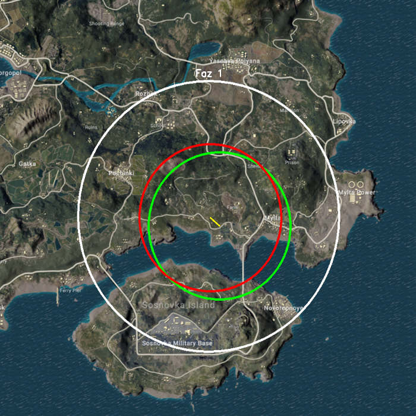

# 🎯 PUBG Safe Zone Prediction

> PUBG Erangel haritasında mevcut güvenli bölgeden bir sonrakini tahmin eden makine öğrenmesi projesi.

## Veri Seti

- 6 gerçek maç verisi
- Yaklaşık 2000 sentetik veri
Burada gerçek maç verisinin az olmasının sebebi, internette projeyle ilgili açık kaynak olarak veri setinin bulunmamasıdır. Bu yüzden gerçek maç verisi azdır. Ekran görüntülerini "raw" klasörüne ekleyip data_labeller.py dosyasını çalıştırarak veri setini oluşturabilirsiniz. Burada manuel etiketleme yapmanız gerekmektedir.

---

## Nasıl Çalışır?

Her PUBG maçında güvenli bölge (safe zone) belirli kurallara göre daralır:

```
distance(mevcut_merkez, sonraki_merkez) ≤ mevcut_R - sonraki_R
```

Bu proje, mevcut fazın **merkez koordinatları ve yarıçapından** bir sonraki fazın merkezini **XGBoost** ile tahmin eder. Yarıçap zaten oyun kuralından bilindiği için tahmin edilmez.

---

## Sonuç Görseli

Beyaz → Mevcut alan &nbsp;|&nbsp; Yeşil → Gerçek sonraki &nbsp;|&nbsp; Kırmızı → Tahmin &nbsp;|&nbsp; Sarı → Sapma



---

## Kurulum

```bash
python -m venv venv
.\venv\Scripts\activate        # Windows
pip install -r requirements.txt
```

---

## Kullanım

Adımları sırayla çalıştırın:

```bash
# 1 — Sentetik veri üretimi (Yaklaşık 2000 maç)
python augment_data.py

# 2 — Model eğitimi ve kaydı
python training.py

# 3 — Görselleştirme
python visualize.py
```

`training.py` çalıştırıldıktan sonra `model.pkl` oluşur. `visualize.py` modeli diskten yükler, her seferinde yeniden eğitmez.

---

## Proje Yapısı

```
PUBGSafeZonePrediction/
│
├── constants.py        # Merkezi sabitler (yarıçaplar, harita boyutları)
├── utils.py            # Paylaşılan yardımcı fonksiyonlar
│
├── data_labeller.py    # Manuel etiketleme aracı (CV2 tıklama arayüzü)
├── augment_data.py     # Sentetik veri üretimi
├── training.py         # Model eğitimi + kaydetme
├── visualize.py        # Harita üzerinde görselleştirme
│
├── zone_data.csv       # Gerçek etiketli veri (6 maç)
├── data_augmented.csv  # Birleşik veri seti [üretilen]
├── model.pkl           # Eğitilmiş model [üretilen]
├── result_map.png      # Görsel çıktı [üretilen]
│
├── requirements.txt
└── reference/
    └── erangel_reference.png   # Referans harita (1181 × 1133 px)
```

---

## Model

| | |
|---|---|
| **Algoritma** | XGBoost + MultiOutputRegressor |
| **Çapraz Doğrulama** | GroupKFold (5-fold) — aynı maç daima aynı fold'da |
| **Giriş** | `[Faz, X, Y, R]` |
| **Çıkış** | `[sonraki_X, sonraki_Y]` |
| **Kural Garantisi** | Tahmin PUBG kısıtını ihlal ederse otomatik sınıra kırpılır |

---

## Erangel Safe Zone Yarıçapları

| Faz | Yarıçap (px) | Yaklaşık (m) |
|:---:|:-----------:|:------------:|
| 1   | 298         | ~2282        |
| 2   | 162         | ~1484        |
| 3   | 99          | ~742         |
| 4   | 48          | ~371         |

> Piksel değerleri, gerçek maç ekran görüntüleri üzerinden `erangel_reference.png` (1181 × 1133 px) referansıyla kalibre edilmiştir.

---

## Yeni Gerçek Veri Ekleme

`raw/` klasörüne `mac07_faz1.png` formatında ekran görüntüleri koyun, ardından:

```bash
python data_labeller.py
```

Etiketleme tamamlanınca pipeline'ı baştan çalıştırın:

```bash
python augment_data.py && python training.py
```
